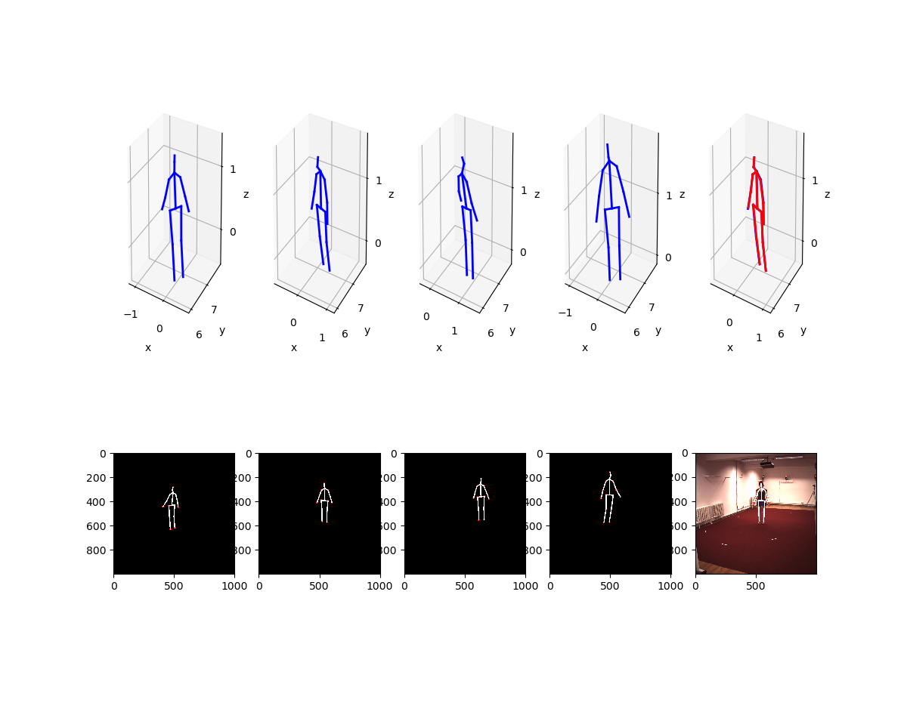

# Multi view Human Pose

data는 아래서 다운 받는다.

[Google Drive](https://drive.google.com/drive/folders/1g6yww-W7E0dEhK2Hz2WfdkSDYBvAavFA?usp=sharing)

h36m_all_data.pickle 파일은 xy평면을 바닥으로 한 3d pose 

h36m_all_data_yz.pickle은 H36M data 그대로 저장한것임 

triangulation_h36m.py는 2d ground truth를 triangulation하여 3d annotation과 함께 보이는 코드로 
2d pose만 정확하다면 triangulation으로 만든 3d pose는 3d annotation과 99% 정확함을 보인다.

구성 

~~~
root_folder   
    L processed : image dataset이 있음  
    L MyHumanData   
        L read_h36m_pickle_with_image.py : 이미지랑 2d, 3d annotation data 시각화    
        L ...  
        L tiangulation_h36m.py : triangulation으로 3d pose 만듬 
~~~

